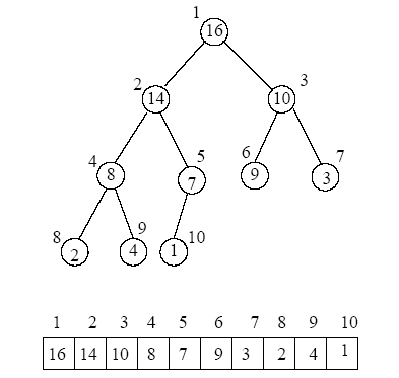

.. include:: <isopub.txt>

.. role:: kurt-code

Heap  and Priority Queues
=========================

Description
-----------

A heap can be viewed visually as a complete binary tree, a binary tree in which nodes are added starting on the left first and moving to the right until the level is complete. Iin a complete binary tree, the height of the left subtree is at most
one more than the height of the right subtree. A heap, though, is not a binary search tree where every right child is greater than its parent, which is greater than its left child. In a heap the ordering of siblings is undetermined, but a parent
is always greater than its child.  

   **Figure 1. Logical Structure of a binary heap.** From: https://www.cs.uaf.edu/2009/spring/cs311/slides/cs311_20090417_heap_pq_stl.pdf

While a heap is understand as a type of complete binary tree, it can be stored compactly in an array. The array representation can be achieved by traversing the binary tree in level order. In the array below, index zero is unoccupied.
The root is placed at index one. 

.. .. figure:: ../images/heap-nodes-numbered.jpg
..    :alt: Logical Structure 
..    :align: center 
..    :scale: 100 %
..    :figclass: custom-figure

..    **Figure 1. Numbering the Nodes of a Complete Binarya binary heap.** 

In the array representation of a heap no space is required for pointers; instead, the parent and children of each node can be found by simple arithmetic on array indices:

===================================== ==============================

===================================== ==============================
  Parent(i) = i/2                      returns position of parent
  Left(i)  = 2i                        returns left child position
  Right(i) = 2i + 1                    returns right child position
===================================== ==============================

If we begin the array at index zero instead of one, the calculations for the position of a node's parent and its two children become:

===================================== ==============================

===================================== ==============================
  Parent(i) = (i-1)/2                  returns position of parent
  Left(i)  = 2i + 1                    returns left child position
  Right(i) = 2i + 2                    returns right child position
===================================== ==============================

.. todo:: Organize the remaining discussion after reading the bookmarked articles and understanding them and how they flow.

Basic Operations
----------------

The abstract heap data type has three primary operatons:

1. **peekTop()**  
2. **add(int priority, const T& t)** 
3. **remove()**

**peekTop()** gets the root of the tree. **add(int priority, const T& t)** adds a new node to the end of the heap, which "trickles up" to its position in the ordering. **remove()**  deletes the root and reheapifyies array by making the last
item the root, and then moving in downward until we again have a value heap.  

Pseudo Code of Array Implementation
-----------------------------------

Code
----

.. code-block:: cpp

  #ifndef HEAP_H_23974923874
  #define HEAP_H_23974923874
  /* 
   * File:   heap.h
   *
   * Created on July 15, 2014, 12:10 PM
   */
  #include <iosfwd>
  #include <ostream>
  #include <iostream>
  #include <iterator>
  #include <algorithm>
  #include <vector>
  #include <exception>
  
  template<typename T> class Heap; // forward declaration
  
  template<typename T> class Heap {
     
    public:
      class Node; //forward declaration of nested class
      class Node {
          
        friend class Heap<T>;  
        
        private:
          int priority;
          T   data;     
        public: 
                        
          Node(int pr, const T& t) : priority(pr), data(t) {}
  
          Node(const Node& n) : priority(n.priority), data(n.data)
          {
          }
  
          Node& operator= (const Node& n);
           
          T getData() const 
          { 
              return data; 
          }
          
          int getPriority() const 
          { 
              return priority; 
          } 
           
          friend bool operator< (const Node& lhs, const Node& rhs)
          { 
              return lhs.getPriority() < rhs.getPriority();
          }
          
          friend bool operator> (const Node& lhs, const Node& rhs)
          {
              return rhs < lhs;
          }    
          
          friend std::ostream& operator << (std::ostream& ostr, const Node& rhs)
          {
              ostr << "[Priority: " << rhs.getPriority() << "; Data: " << rhs.getData() << "]";
              return ostr;
          }
      };
         
      private:
          
          std::vector<Node> vec;
          /* 
           * bottom-up reheapify ("swim up"). Continue to swap the value in index pos with the appropriate value above it, if necessary,
           * until we again have a valid heap. 
           */ 
          void swim(int pos); 
      protected:
       /*
        * top-down reheapify. Move the value in index pos downward ("sink down"), if necessary, until we again 
        * have a valid heap        
        */
          void sink(int pos); 
  
      public:   
          
       Heap(int size);
       Heap();
       bool isEmpty() const;
       T peekTop() const throw(std::logic_error);
       void add(int priority, const T& t);
       bool remove();
       void clear();
       
       template<typename U> friend std::ostream&  operator<<(std::ostream&  ostr, const Heap<U>& heap);
  };
  template<typename T> typename Heap<T>::Node& Heap<T>::Node::operator= (const typename Heap<T>::Node& n)
  {
     if (this != &n) { 
                 
          priority = n.priority;
          data = n.data;
      } 
      return *this;
  }       
  
  template<typename T> inline bool Heap<T>::isEmpty() const
  {
    return vec.size() == 0;
  }
  
  template<typename T> T Heap<T>::peekTop() const throw(std::logic_error)
  {
     if (vec.size() > 0) {
  
        return vec[0].getData();
  
     } else {
     
        throw std::logic_error(std::string("peekTop() called on empty heap"));
     }
  }
  
  template<typename T> inline Heap<T>::Heap(int size) : vec(size)
  {
  }
  
  template<typename T> inline Heap<T>::Heap() : vec()
  {
  }
  
  template<typename T> bool Heap<T>::remove()
  {
     if (vec.empty()) {
  
         return false;
     }
       
     // put last item in root
     vec[0] = vec[vec.size() - 1];
             
     vec.pop_back(); // then remove the formerly last item
  
     sink(0);  
  
     return true;
  }
  
  template<typename T> void Heap<T>::swim(int index)
  {
      // move new item up until we have a valid heap
      int parentIndex;
  
      while (index > 0) { 
  
          parentIndex = (index - 1) / 2;
          
          if (vec[index] < vec[parentIndex]) {
         
             break; 
  
          }  else {        
  
             std::swap(vec[index], vec[parentIndex]);
  
             index = parentIndex;
          }
      }
  }
  
  template<typename T> void Heap<T>::add(int x, const T& t)
  {
      vec.push_back(Node(x, t)); 
  
      int index = vec.size() - 1;
  
      swim(index); // heapify upwards
  }
  
  template<typename T> inline void Heap<T>::sink(int root)
  {
    int child = 2 * root + 1; // child set to index of root's prospective left child
  
    if (child < vec.size()) {
  
       // root was not a leaf, so it has a left child at child    
       
       int right_child = child + 1; // index of right child, if any
  
       if (right_child < vec.size() && vec[right_child] > vec[child]) {
              
             child = right_child; // child is now is the index of larger child  
        }
  
        // Swap root with larger child, if root smaller      
        if (vec[root] < vec[child]) {
  
             std::swap(vec[root], vec[child]); 
  
             // ... and continue the process 
             sink(child);
        }  
    }
  }
  
  template<typename U> std::ostream&  operator<<(std::ostream&  ostr, const Heap<U>& heap)
  {
      std::ostream_iterator<typename Heap<U>::Node> out_it(ostr, ", ");
      std::copy (heap.vec.begin(), heap.vec.end(), out_it);
      return ostr;
  }
  
  #endif	
