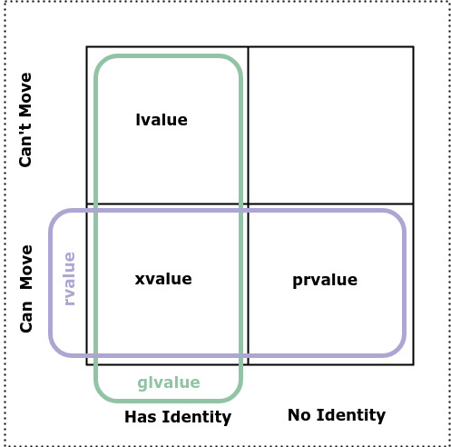

Introduction to C++11 Value Categories
======================================

lvalues in the C Programming Language [#1]_ 
--------------------------------------------

.. todo:: Merge what is in new-vlau-rvalue.rst into this file. Have idex.rst reference this file instead of value-categories.rst.

In C (prior to C++) expressions were categorized as **lvalue expressions** and others (functions and non-object values), where **lvalue** meant an expression that identifies an object, a region of data storage that may have a value, a "locator value" in memory; 
for example,

.. code-block:: cpp

    int n;
    n = 1;

In the expression ``n = 1`` above, the subexpression **n** refers to an integer object, a specific location in memory. Thus **n** is an lvalue, a storage location that can hold a value. The term **lvalue** originally derived its name from the fact that only objects can
appear on the left hand side of an assignment and can be assigned to, but in C++11 the "l" in lvalue is no longer of any real significance, and lvalues occur in contexts outside of assignment.

.. todo:: Print out both files--new-lvalue-rvalue.rst and references-in-modern-cplusplus.rst (which started as a copy of value-categories.rst)--read and digest them and then merge the essential information in the former into the later.

References are implemented using pointers
-----------------------------------------

References are implemented using pointers. References act like a const pointer that's dereferenced automatically. And like a dereferenced pointer ``*p``, which yields an lvalue, a reference, too, is an lvalue expression.
The concepts of lvalues and rvalues help explain C++ reference types, and the real strength of references comes out in operator overloading. 

Advantage over Pointers
-----------------------

References allow classes to overloaded built in operators while still allowing objects to passed as arguments. When reference-to-const arguments are used, the same syntax and exactly the same usage as pass-by-value is supported. For example,

.. code-block:: cpp

    class complex {
        complex operator+(const complex& param);
        //....
    }; 

The complex binary + operator takes a "reference to const". This parameter will bind to both const of non-const objects. If we had written ``complex operator+(complex& param)``, then param would only bind to non-cost lvalue arguments.
A "reference to const" of type T binds to both const and non-const lvalues expressions involving objects of type T, and also to an rvalue, say x, if x is convertible to T. For example

.. code-block:: cpp

     int const &intref = 3; 
     const double& dref = intref;

Here 3 being an int is obviously "convertable" to an int, and so the compiler creates a temporary to hold 3 and binds ``intref`` to it. The same thinking applies to the second line. ``intref`` is an lvalue that is convertable to a double.
The compiler creates a temporary and stores the converted-to double value and, then, binds ``dref`` to it. 

Only const references can bind to rvalues. If ``intref`` were a non-const reference to a int, then it would not bind to 3 and no temporary would be created. 

Why does C++ create the temporary? C++ does this to mimic the behavaior of pass by value, so pass by value and pass by reference look the same in all cases. For example, the pass-by-value function ``f`` and the pass-by-const-reference function ``fref`` below behave the same way.

.. code-block:: cpp

    long double x;
    void f(long double ld);
    //...
    f(x); // passes a copy of x
    f(1); // passes a copy of 1 converted to a double.
    void fref(const long double& ld);
    fref(x); // ld is const reference to the double x.  
    fref(1); // passes a reference to a temporary, a copy of 1, converted to a double.

.. todo:: resume the merging of new-lvalue-rvalue.rst into this document here.

lvalues, rvalues and references in C++03
----------------------------------------

Pre-2011 C++ followed the C model, but assigned the name **rvalue** to non-lvalue expressions. In the expression ``n = 1;``, for example, ``1`` is an rvalue because it is not an object, not a location in memory, and thus not an lvalue.
C++03 added the rule that references can bind to lvalues, but only references-to-const can bind to rvalues (in addition to binding to both const and non-const lvalue expressions). Several non-lvalue C expressions also became lvalue (<-- do I mean rvalue?Listen again to
Ben Saks at https://www.youtube.com/watch?v=XS2JddPq7GQ ) expressions in C++.

Distinguishing rvalues from lvalues allows the compiler to improve the efficiency of the code it generates. The compiler does not need to place rvalues in storage (although this does not apply to class instances as will be discussed).

When an lvalue is used on the right hand side of an assignment as below

.. code-block:: cpp

    int n, m;
    n = 1;
    m = n; // m and n are both lvalues. n undergoes lvalue-to-rvalue conversion. 

it is said to undergo **lvalue-to-rvalue** conversion. In ``m = n``,  **n** undergoes lvalue-to-rvalue conversion. When we talk about something being an lvalue, we are concerned with where the object lives, but when we only need to know the value it holds, we can view the object, the lvalue in this example,
as an rvalue.

lvalues and rvalues are relevant in contexts other than assignment. Take, for example, the binary operator +. It operands can be either rvalues or lvalues. 

.. code-block:: cpp

    x + 2   // lvalue + rvalue
    5 + 2   // rvalue + rvalue
    x + y   // lvalue + lvalue

The result of the + operation is a temporary object that the compiler may place in a register. Since this temporary object is not guaranteed to be in memory, it is therefore an rvalue. Another of example of an lvalue is the 
result of the derefence operator

.. code-block:: cpp

    int a[N];
    int *p = a;
    char *s = nullptr;
    *p = 3;       // *p is an lvalue  
    *s = '\0';    // *s is an lvalue even though s is null and even though *s causes undefined behavior.

``*s`` is an lvalue even though ``s`` is nullptr and even though ``*s`` causes undefined behavior. 

In C++, rvalues of class type do occupty data storage. Why? Consider this example 

.. code-block:: cpp

    struct S {int x; int y;};
    S foo();
    int j = foo().y; // foo() is an rvalue that occupies storage.

To get the y member of ``foo().y``, the compiler first needs the base address of the struct S returned by foo(), and any object with an address occupies storage.

**Recapping lvalues and rvalues so far** 

============== =================== =============
Value Category Can Take Address Of Can Assign To
============== =================== ============= 
lvlaue         yes                 yes
const lvlaue   yes                 no
rvalue         no                  no
============== =================== ============= 

While conceptually rvalues don't occupy storage, rvalues of class type do, and "const references to a temporary" also causes the temporary to be placed in storage. For example 

.. code-block:: cpp

    const int& int_ref1 = 10; 
    int& int_ref2 = 11;      // Error: int_ref2 is not const  

in the code above, the temporary 10 is place in storage so that the const refernence to int can bind to it. Without 'const' the compiler issues an error.        

lvalues and rvalues in C++11
----------------------------

What were previously called “references” in C++03 are now called **lvalue references** in C++11. This was done to distinguishes them from the new **rvalue references** of C++11. **lvalue references** in C++11 behave just like references did in C++03. On the other hand,
**rvalue refernces** in C++11 are used primarily as parameter declarations for move constructors and move assignment operators, and as a function return type, primarily the return type of std::move(). Move construction and move assignment significantly improve performance
when the compiler detects an rvalue by "stealing" instead of copying resources.  

What were previously called rvalues in C++03 are now called **prvalues** in C++11, and another new rvalue subcategory, **xvalues** or "expiring values", was introduced. xvalues result when a lvalue is cast to an rvalue reference or when
a method returns an rvalue reference. "Pure rvalues" abbreviated **prvalues** don't occupy data storage. "Expiring values" abbreviated **xvalues** that do occupy storage.

.. todo:: Read C++ Move Semantics by Nikolai Josuttis. 

.. note:: As a programmer you don't need to worry about the distinction prvalues and xvalues. These terms exist in the C++ standard so compiler authors know what needs to be done.
 
lvalue references are declared using single `&` and rvalue reference are declared using a double `&&`. rvalue references can be used as function parameters and return types, for example 

.. code-block:: cpp

    int&& ri = 10; // rvalue reference to int. 
    double &&f(int &&rint); 

    const int&& rci = 20;  // A const rvalue reference is not really of any use.

The primary use of rvalue references is as functon parameters and return types. Their purpose is not primarily to allow us to delcare variables like ``ri`` above.

rvalue references can only bind to rvalues. This is true even for a "rvalue reference to const", as in the example below

.. code-block:: cpp

    int n = 10; 
    int &&ri = n;       // error: n is an lvalue. 
    const int &&rj = n; // error: n is an lvalue. 

temporary materialization conversion
++++++++++++++++++++++++++++++++++++

When a temporary is created due to binding to a const reference, it undergoes what is called a "temporary materialization conversion" that converts a prvalue into an xvalue. This places the pure rvalue, the prvalue, that is not in storage, into storage, and making it an xvalue.
For example, in the code below

.. code-block:: cpp

    class string {
      public:
         string(const string&);
         string(const char *); // converting construcotr
         string& operator=(const string&);
         //...  
    }; 

   string operator+(const string& lo, const string& ro); // lvalue reference to const will bind to both lvalues and rvalues. 	
   string s{"hello"};
   string t{"world"};
 
   s = s + ", " t; 

the compiler implicitly invokes the converting constructor ``string::string(const char*)`` to convert the character string ", " into a string object:  

.. code-block:: cpp

    s = s + string(", ") + t; // lvalue + rvalue + lvalue

The binary operator ``operator+(const string& lo, const string& ro)`` returns an rvalue. Since we can't do something like

.. code-block:: cpp

   string *p = &(s + t); // error: can't take address of rvalue.

the result of ``operator+(const string& lo, const string& ro)`` must be an rvalue.
 
We saw that binding an "lvalue reference to const" to an rvalue triggers a temporary materialization conversion, in which a prvalue that is not in storage is turned into a xvalue that is placed in storage. The temporary materialization conversion also
occurs when we bind an "rvalue reference" to an rvalue. When we bind a rvalue reference to an rvalue, an xvalue is created. 

What rvalue references offer
++++++++++++++++++++++++++++

The main reason rvalue references are in C++11 is to provide more efficient move constructors and move assignment operator that the compiler can call whenever it detects an rvalue.

.. code-block:: cpp

    class string {
      public:
         string(const string&);
         string(const char *);                // converting construcotr
         string& operator=(const string&);
                                               
         string(string&&) noexcept;            // move constructor
         string& operator=(string&&) noexcept; // move assignment 
         //...  
    }; 

    string s1, s2, s3;
    s1 = s2;         // Because s2 is not expiring, and it must be preserved, the copy constructor is invoked. 

    s1 = s2 + s3;    // Since the result of s1 + s2 expires at the end of the statement, it can be moved from.

The result of ``s2 + s3`` is an rvalue that expires at the end of the statement. Since rvalues can be moved from, the more efficient move constructor will be called.

.. note:: rvalue reference parameters are considered lvalues within the body of the function.

Take, for example

.. code-block:: cpp

    string& string::operator=(string&& other) noexcept
    {
        string temp(other); // invokes copy constructor
        //...
    }

Because the rvalue reference parameter "other" has a name, it is an lvalue within ``string::operator=(string&&other)``.

Converting lvalues into xvalues, eXpiring values
++++++++++++++++++++++++++++++++++++++++++++++++

``std::swap()`` is an good example of where we would like to force the compiler to move an object's state instead of copying it. Take, for example,

.. code-block:: cpp

    template<class T> void swap(T& a, T& b)
    {
       temp t(a);
       a = b;
       b = t;
    }   

This code invokes the copy constructors for T. But since we know that the state of ``a`` does not need to preserved, it is therefore more efficient to move its state. But to do so, we need to tell the compiler that ``a`` does not need to be preserved by casting it from an lvalue
to an xvalue. This is done by calling ``std::move()``, which converts the input parameter into an xvalue, an unamed rvalue reference. ``std::move()`` could perhaps better have been named ``std::rvalue()`` or ``std::xvalue()``.

.. code-block:: cpp

    template<typename T> constexpr typename std::remove_reference<T>::type&& move(T&& t) noexcept
    {
       return static_cast<typename std::remove_reference<T>::type&&>(t); 
    }

Since return values never have names, calling ``std::move()`` returns an unamed rvalue reference.

.. code-block:: cpp

    template<class T> void swap(T& a, T& b)
    {
       temp t(std::move(a));
       a = std::move(b);
       b = std::move(t);
    }   

What Distinguishes Value Categories
-----------------------------------

The figure below show that the two key properties that distinguishes the value categories of C++11 are "has identity" and "move-able":
    

   **Figure: value categories** 

An xvalue Example
+++++++++++++++++

.. code-block:: cpp

    void f(vector<string>& vs)
    {
       vector<string>& v2 = move(vs); 
       //...
    }

``move(vs)`` is an xvalue. It has identity. We can refer to it as **vs**, but we have cast it to an unamed rvalue reference. Since ``move(vs)`` is moveable and has identity it is an xvalue.

.. code-block:: cpp

    struct A { ... };
    A a;             // a is an lvalue
    static_cast<A&&>(a); // but this expression is an xvalue.

In the code example above, we haven't moved anything yet. We've just created an xvalue by casting an lvalue to an unnamed rvalue reference. It can still be identified by its lvalue name; but, as an xvalue, it is now capable of being moved. 
But you can think of the "x" in "xvalue" as meaning "expert-only" if that helps. By casting an lvalue into an xvalue (a kind of rvalue), the value then becomes capable of being bound to an rvalue reference.

Further Explanantion and Examples
---------------------------------

Microsoft's `Value categories, and references to them <https://docs.microsoft.com/en-us/windows/uwp/cpp-and-winrt-apis/cpp-value-categories>`_ is an excellent explantion of the "has identity" and "move-able" properties that characterize and distinguish lvalues, xvalues and prvalues.
The articles also contains examples of each of the value category.

Examples of lvalues, xvalues and prvalues can be found at:

* `Value Categories cheatsheet <https://github.com/jeaye/value-category-cheatsheet/blob/master/value-category-cheatsheet.pdf>`_
* `The deal with C++14 xvalues  <https://blog.jeaye.com/2017/03/19/xvalues/>`_
* The cppreference.com article `Value categories <https://en.cppreference.com/w/cpp/language/value_category#history>`_

Value Categories in C++17
-------------------------

.. todo:: Mention the important change in C++17 having to do with materialization and how this relates to value categories!!!!!

Reference Articles
------------------

* `CppCon 2019:Ben Saks “Back to Basics: Understanding Value Categories <https://www.youtube.com/watch?v=XS2JddPq7GQ>`_
* https://docs.microsoft.com/en-us/windows/uwp/cpp-and-winrt-apis/cpp-value-categories
* `Bjarne Stroustrup Article Introducing Value Categories <http://www.stroustrup.com/terminology.pdf>`_
* `Professor Sheep Video: C++ lvalue rvalue xvalue glvalue prvalue <https://www.youtube.com/watch?v=yIOH95oIKbo>`_
* `Stackoverflow Explanation <https://stackoverflow.com/questions/3601602/what-are-rvalues-lvalues-xvalues-glvalues-and-prvalues>`_ 

.. rubric:: Footnotes

.. [#1] This material is from both the cppreference.com article `Value Categories <https://en.cppreference.com/w/cpp/language/value_category#history>`_ and `CppCon 2019:Ben Saks “Back to Basics: Understanding Value Categories" <https://www.youtube.com/watch?v=XS2JddPq7GQ>`_ and `Chapter 5 of C++17 The Complete Guide by Nikolai Josuttis <http://www.cppstd17.com/>`_.
