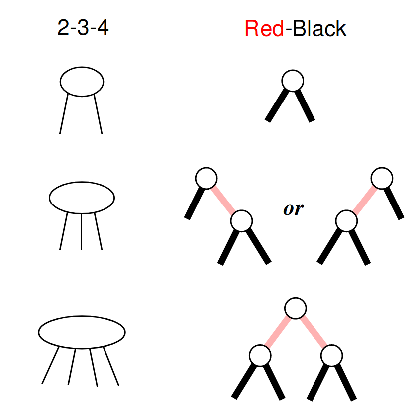

Red Black Trees
---------------

The algorithms shown in :ref:`2-3-trees` and :ref:`2-3-4-trees` ensure a tree structure that is always balanced, but both a 2-3 tree and 2-3-4 tree waste storage since 3-node and 4-nodes are not always full.

A red black tree is  a way of representing a 2 3 4 tree as neraly balanced binary search tree. Each node of a red black tree has an associated color, either red or black. The nodes of a 2 3 4 tree map can be mapped to the nodes
a red black tree as shown in the image below:

   **Figure: Mapping of 2 3 4 nodes to red black nodes**

If both children of a node are black nodes, then that node represents a 2-node. If one child is red and the other is black, that red black node represents a 3-node. If both children are red, then that node represents a 4-node.
There is only one representation of a 2-node, and there is only one possible representation of a 4-node; but there are two possible representations of a 3-node, but they are still symmetrical. 

`USC lecture slides on B-Trees (2-3, 2 - 3 - 4) and Red/Black Trees <ee.usc.edu/~redekopp/cs104/slides/L19b_BalancedBST_BTreeRB.pdf>`_. Discussion of red black trees starts on p. 44/
and this University of Michigan `Lecture on Red-Black Trees <http://web.eecs.umich.edu/~sugih/courses/eecs281/f11/lectures/11-Redblack.pdf>`_.

.. todo: add the code
