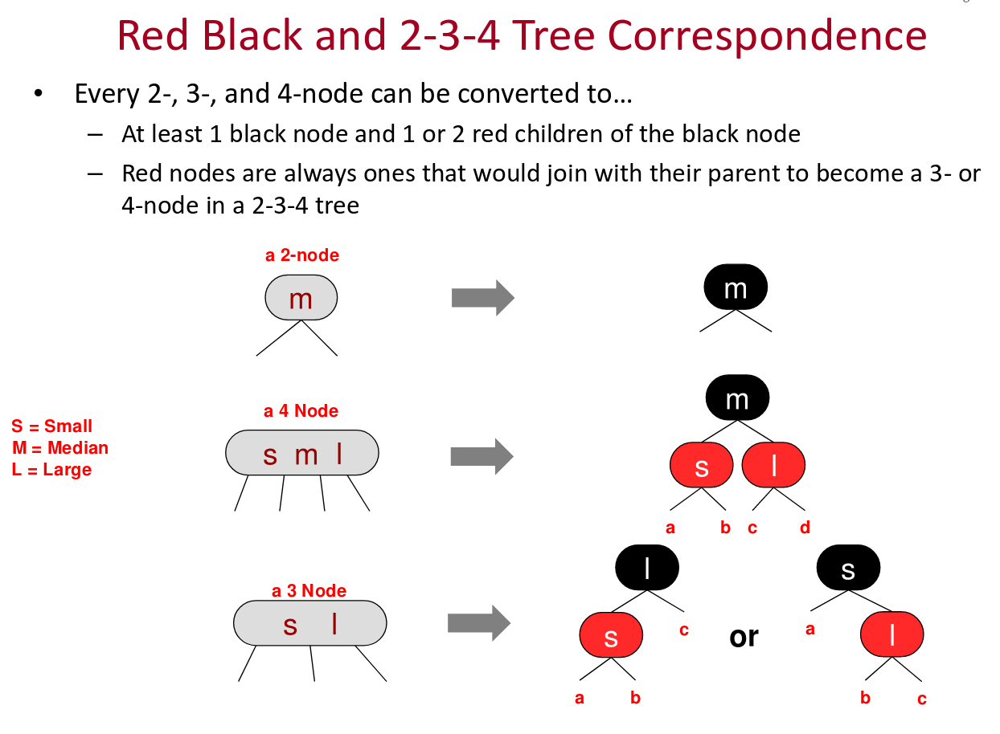

.. include:: <isonum.txt>

Red Black Trees (under develpment)
----------------------------------

The algorithms shown in :ref:`2-3-trees` and :ref:`2-3-4-trees` ensure a tree structure that is always balanced, but both a 2-3 tree and 2-3-4 tree waste storage because their 3-node and 4-nodes are not always full.

A red black tree is a way of representing a 2 3 4 tree as a nearly\ |apos|\ balanced binary search tree. Each edge of a red black tree is colored red or black, where red edges represent the values within a 3- or 4-node, while black edges represent the children.
Using these coloring conventions, the nodes of a 2 3 4 tree map map to the nodes of a red black tree as shown in the image below (taken from these `2 3 4 Tree Lecture Notes <http://faculty.cs.niu.edu/~freedman/340/340notes/340redblk.htm>`_):

   **Figure: Mapping of 2 3 4 nodes to red black nodes.** 

If both edges (children) of a node are black, the node represents a 2-node. If one child is red and the other is black, the node represents a 3-node. If both children are red, then that node represents a 4-node. There is only one representation of a 2 3 4 tree's
2-node, and there is only one possible representation of 2 3 4 tree's 4-node, but there are two possible representations of a 3-node, but both are symmetrical, and both represent a unique 4-node.

A red black tree also conforms to these invariants:

* The root is always black, i.e., it has two black edges. It thus represents a 2-node.
* black condition - every path from the root to a leaf node has the same number of black links/nodes
* red condition - no path from the root a leaf node has two or more consecutive red links/nodes (ie. every red node will have a black parent)

.. todo:: How do these invariants map a 2 3 4 tree? What is there purpose?

Other sources:

* `USC lecture slides on B-Trees (2-3, 2 - 3 - 4) and Red/Black Trees <http://ee.usc.edu/~redekopp/cs104/slides/L19b_BalancedBST_BTreeRB.pdf>`_. 
* `Lecture on Red-Black Trees <http://web.eecs.umich.edu/~sugih/courses/eecs281/f11/lectures/11-Redblack.pdf>`_. Discussion of red black trees starts on p. 44. Also see this University of Michigan

.. todo: add the codeblack condition - every path from the root to a leaf node has the same number of black links/nodes
