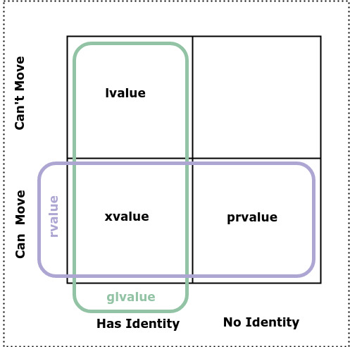
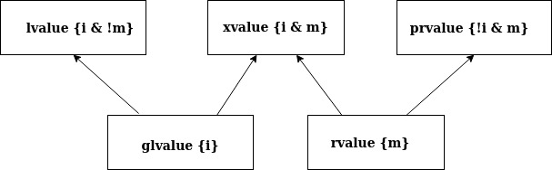

Value Categories: Revision
==========================

Helpful Articles
----------------

* `CppCon 2019:Ben Saks “Back to Basics: Understanding Value Categories <https://www.youtube.com/watch?v=XS2JddPq7GQ>`_
* https://docs.microsoft.com/en-us/windows/uwp/cpp-and-winrt-apis/cpp-value-categories
* `Bjarne Stroustrup Article Introducing Value Categories <http://www.stroustrup.com/terminology.pdf>`_
* `Video: C++ lvalue rvalue xvalue glvalue prvalue <https://www.youtube.com/watch?v=yIOH95oIKbo>`_
* `Stackoverflow Explanation <https://stackoverflow.com/questions/3601602/what-are-rvalues-lvalues-xvalues-glvalues-and-prvalues>`_ 

As Nikolia Josuitis noted in `C++17 The Complete Reference <http://www.cppstd17.com/>`_ , on page ??, Value Categories don't apply to values but rather to expressions.

From the C Programming Language to C++ [#fhistory]_
---------------------------------------------------

In C expressions were categorized as "lvalue expressions" and others (functions and non-object values), where "lvalue" meant an expression that identifies an object, a "locator value" in memory; 
for example,

.. code-block:: cpp

    int n;
    n = 1;

in the expression ``n = 1``, the subexpression **n** refers to an integer object, a specific location in memory. Thus **n** is an lvalue. The term lvalue derives its name from the fact that only objects can
appear on the left hand side of an assignment and can be assigned to.

lvalue and rvalue relevances in C++03
^^^^^^^^^^^^^^^^^^^^^^^^^^^^^^^^^^^^^

Pre-2011 C++ followed the C model, but assigned the name "rvalue" to non-lvalue expressions, made functions into lvalues, and added the rule that references can bind to lvalues, but only
references to const can bind to rvalues. Several non-lvalue C expressions became lvalue expressions in C++. In the expression above ``n = 1;``, **1** is an rvalue because it is not an object, a location in memory, an lvalue.

Distinguishing rvalues from lvalues allows the compiler to improve the efficiency of the code. The compile does not need to place rvalues in storage. When an lvalue is used on the right hand side of an assignment

.. code-block:: cpp

    int n, m;
    n = 1;
    m = n; // m undergoes lvalue to rvalue conversion

it is said to undergo *lvalue-to-rvalue* conversion. When we talk about something being an lvalue, we are concerned with where the object lives, but when we only need to know the value it holds, we can view the object as an rvalue.

lvalues and rvalues are relevant in other contexts than assignment. The binary operator + is an example. It operands can be either rvalues or lvalues. 

.. code-block:: cpp

    x + 2   // lvalue + rvalue
    5 + 2   // rvalue + rvalue
    x + y   // lvalue + lvalue

The result of the + operation is a temporary object that the compiler may place in a register. Since this temporary object is not guaranteed to be in memory, it is therefore an rvalue. Another of example of an lvalue is the 
result of the derefence operator

.. code-block:: cpp

    int a[N];
    int *p = a;
    char *s = nullptr;
    *p = 3;     // *p is an lvalue  
    *s = '\0';  // *s is an lvalue even though s is null and *s causes undefined behavior.

In C++, rvaluse of class type do occupty data storage. Why? Consider this example 

.. code-block:: cpp

    struct S {int x; int y;};
    S foo();
    int j = foo().y; // foo() is an rvalue that occupies storage.

To get the y member of the ``foo().y``, we need the base address of the struct S returned by foo(), and any object with an address occupies storage.

**Recap so far** 

============== =================== =============
Value Category Can Take Address Of Can Assign To
============== =================== ============= 
lvlaue         yes                 yes
const lvlaue   yes                 no
rvalue*        no                  no
============== =================== ============= 

.. note:: Conceptually rvalues don't occupy storage; however, rvalues of class type do occupy storage, and const references to temporaries also must place the temporary in storage. 

Types of rvalues
++++++++++++++++

There are actually two kinds of rvalues:

* "Pure rvalues" or **prvalues** don't occupy data storage
* "Expiring values" or **xvalues** do occupy storage

.. note:: As a programmer you don't need to worry about the distinction between what is a prvalue and what is an xvalue. These terms exist in the Standard so compiler authors know what needs to be done.

When a temporary is created due to binding to a const reference, it undergoes what is called a "temporary materialization conversion" that converts a prvalue into an xvalue. For example, take

.. code-block:: cpp

    class string {
      public:
         string(const string&);
         string(const char *); // converting construcotr
         string& operator=(const string&);
         //...  
    }; 

   string operator+(const string& lo, const string& ro); // reference to const will bind to both lvalues and rvalues. 	
   string s{"hello"};
   string t{"world"};
 
   s = s + ", " t; 

Here the compiler implicitly does 

.. code-block:: cpp

    s = s + string(", ") + t; // lvalue + rvalue + lvalue

Now since ``operator+(const string& lo, const string& ro)`` returns an rvalue, we can't do something like

.. code-block:: cpp

   string *p = &(s + t); // error: can't take address of rvalue.

C++11
^^^^^

What where called "references" in C++03, C++11 calls "lvalue references". This distinguishes them from C++11's "rvalue references". lvalue references in C++11 behave just like references in C++03. rvalue refernces are
new in C++11. lvalue references are declared using single `&` and rvalue reference are declared using a double `&&`. You can also use rvalue references as function parameters and return types, as in:

.. code-block:: cpp

    int&& ri = 10; // rvalue reference to int. 
    double &&f(int &&rint); 

    const int&& rci = 20;  // A const rvalue reference is not really of any use.

In fact, the primary use of rvalue references is as funciton parameters and return types. They are not primarily to delcare variables like ``ri`` above.

rvalue references can only bind to rvalues. This is true even for "rvalue reference to const", for example:

.. code-block:: cpp

    int n = 10; 
    int &&ri = n;       // error: n is an lvalue. 
    const int &&rj = n; // error: n is an lvalue. 

We saw previously that binding an "lvalue reference to const" to an rvalue triggers a temporary materialization conversion, where a prvalue is turned into a xvalue. The temporary materialization conversion also occurs when we bind an
"rvalue reference" to an rvalue. An xvalue is created. 

The reason for rvalue references
++++++++++++++++++++++++++++++++

rvalue references are in C++11 mainly to provide more efficient move constructors and move assignment operator that the compiler can call when it detects an rvalue.

.. code-block:: cpp

    class string {
      public:
         string(const string&);
         string(const char *);                // converting construcotr
         string& operator=(const string&);
         string(string&&) noexcept;           // constructor
         string& operator=(string&&) noexcept; // assignment 
         //...  
    }; 

    string s1, s2, s3;
    s1 = s2;         // Because s2 is not expiring, and it must be preserved, the copy constructor is invoked. 
    s1 = s2 + s3;    // Since the result of s1 + s2 expires at the end of the statement, it can be moved from.

rvalue reference parameters are considered lvalues within the body of the function. For example, in

.. code-block:: cpp

    string& string::operator=(string&& other) noexcept
    {
        string temp(other); // invoke copy constructor
        //...
    }

because the rvalue reference parameter other has a name, it is an lvalue within operator=.

Converting lvalues into xvalues, Expiring values
++++++++++++++++++++++++++++++++++++++++++++++++

std::swap() is an example where we want to force the compiler to move an object's state instead of copying it. For example,

.. code-block:: cpp

    template<class T> void swap(T& a, T& b)
    {
       temp t(a);
       a = b;
       b = t;
    }   

invokes copy constructors. But we know that the state of ``a`` does not need to preserved. Therefore, to tell the compiler that ``a`` does not need to be preserved, we must converting it from an lvalue to an xvalue. 
This is what ``std::move()`` does. It converts the input parameter to an unamed rvalue reference, an xvalue.

.. code-block:: cpp

    template<typename T> constexpr typename std::remove_reference<T>::type&& move(T&& t) noexcept
    {
       return static_cast<typename std::remove_reference<T>::type&&>(t); 
    }

Since return values never have names, calling ``std::move()`` returns an unamed rvalue reference.

.. code-block:: cpp

    template<class T> void swap(T& a, T& b)
    {
       temp t(std::move(a));
       a = std::move(b);
       b = std::move(t);
    }   

This figure shows the properties of ...ELABORATE.
    

   **Figure: value categories** 

STOPPED AT 50:00

.. note:: prior notes below.

Introduced in C++11, move semantics required value categories to be redefined. C++11 has three main value categories: lvalue, xvalue (or eXpiring value), and prvalue (pure rvalues). To explain these categories,
we quote from page 166 of **The C++ Programming Language, 4th Edition**:

    There are two properties that matter for for an object when it comes to addressing, copying and moving:
    
    * **Has Identity**: The program has the name of, address of, or reference to the object so that it is possible to determine if two objects are the same, whether the value has changed,
      etc.
    * **Movable**: the object may be moved from (i.e. we are allowed to move its value to another location and leave the object in a valid but unspecified state, rather than copying it).
    
    It turns out that three of the four possibilities of these two properites are needed to precisely describe the C++ language rules (we have no need for object that do not have
    identity and cannot be moved). Using "**m** for movable" and "**i** for has identity", we can represent this classification of expressions graphically:
    

   **Figure: value categories** 

    So, a classical lvalue is something that has identity and cannot be moved (because we could examine it after the move), and a classical rvalue is anything that we are allowed to move
    from. 

.. todo:: Add BS comments on each these terms and an example or two -- all from pa 166. 

..

Another good explanation of C++11 value categories is from `cppreference's article <https://en.cppreference.com/w/cpp/language/value_category>`_, which offers this explanation:
    
    With the introduction of move semantics in C++11, value categories were redefined to characterize two independent properties of expressions:
    
    * **has identity**: it's possible to determine whether the expression refers to the same entity as another expression, such as by comparing addresses of the objects or the functions they identify (obtained directly or indirectly)
    * **can be moved from**: move constructor, move assignment operator, or another function overload that implements move semantics can bind to the expression. 
    
    This lead to the following value categories for expressions:
    
    **have identity** and **cannot be moved from** are called lvalue expressions;
    **have identity** and **can be moved from** are called xvalue expressions;
    **do not have identity** and **can be moved from** are called prvalue ("pure rvalue") expressions;
    **do not have identity** and **cannot be moved from** are not used. 
    
    The expressions that have identity are called "glvalue expressions" (glvalue stands for "generalized lvalue"). Both lvalues and xvalues are glvalue expressions.
    
    The expressions that can be moved from are called "rvalue expressions". Both prvalues and xvalues are rvalue expressions.
    
.. todo:: include a similar diagram as the last one on https://blog.knatten.org/2018/03/09/lvalues-rvalues-glvalues-prvalues-xvalues-help

Examples
--------

.. todo:: Evaluate these articles:

See the examples and explanations `Building Intuition on value categories <http://marcodiiga.github.io/building-intuition-on-value-categories>`_. How worthwile is this article? 
Check out this article   http://bajamircea.github.io/coding/cpp/2016/04/07/move-forward.html. Same question.
These are two very good sites: `The deal with C++14 xvalues <https://blog.jeaye.com/2017/03/19/xvalues/>`_ and `Value Categories cheatsheet <https://github.com/jeaye/value-category-cheatsheet/blob/master/value-category-cheatsheet.pdf>`_ <-- very good.

.. todo:: Mention C++17 materialization changes impact on value categories.

.. todo:: Use BS's example on page 166 and any cppreference or other articles-above examples. Also synthesize any important explanations from the other articles, including Dr. Sheep's video. The keep thing is to provide examples at top. 
   Finally add BS's conclusion from C++PL that the two practical categories are rvalue and value. Add a final comment about C++17 and materialization.

.. rubric:: Footnotes

.. [#fhistory] This material is from `Value Categories <https://en.cppreference.com/w/cpp/language/value_category#history>`_.
