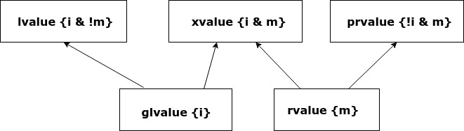

Value Categories: Revision
==========================

As Nikolia Josuitis noted in `C++17 The Complete Reference <http://www.cppstd17.com/>`_ , on page ??, Value Categories don't apply to values but rather to expressions.

Value categories Historically
-----------------------------

.. todo:: Use footnotes to cite sources

Here is a `history of value categories <https://en.cppreference.com/w/cpp/language/value_category#History>`_ from the C programming language to C++17 [take from cppreference and BS].

C Programming Language 
^^^^^^^^^^^^^^^^^^^^^^

C expressions were categorized as "lvalue expressions" and others (functions and non-object values), where "lvalue" meant an expression that identifies an object, a "locator value". 

C++98
^^^^^

Pre-2011 C++ followed the C model, but assigned the name "rvalue" to non-lvalue expressions, made functions into lvalues, and added the rule that references can bind to lvalues, but only
references to const can bind to rvalues. Several non-lvalue C expressions became lvalue expressions in C++. 

C++11
^^^^^

Introduced in C++11, move semantics required value categories to be redefined. Quoting from page 166 of the C++ Programming Language, 4th Edition:

There are two properties that matter for for an object when it comes to addressing, copying and moving:

* *Has Identity*: The program has the name of, address of, or reference to the object so that it is possible to determine if two objects are the same, whether the value has changed, etc.
* *Movable*: the object may be moved from (i.e. we are allowed to move its value to another location and leave the object in a valid but unspecified state, rather than copying it).

It turns out that three of the four possibilities of these two properites are needed to precisely describe the C++ language rules (we have no need for object that do not have identity and cannot be moved). Using "**m**
for movable" and "**i** for has identity", we can represent this classification of expressions graphically:

   **Figure: value categories** 

So, a classical lvalue is something that has identity and cannot be moved (because we could examine it after the move), and a classical rvalue is anything that we are allowed to move from." 

cppreference's value categories `article <https://en.cppreference.com/w/cpp/language/value_category>`_ offers this explanation of the change in value categories introduced by C++11 this way:

With the introduction of move semantics in C++11, value categories were redefined to characterize two independent properties of expressions:

* **has identity**: it's possible to determine whether the expression refers to the same entity as another expression, such as by comparing addresses of the objects or the functions they identify (obtained directly or indirectly)
* **can be moved from**: move constructor, move assignment operator, or another function overload that implements move semantics can bind to the expression. 

This lead to the following value categories for expressions:

**have identity** and **cannot be moved from** are called lvalue expressions;
**have identity** and **can be moved from** are called xvalue expressions;
**do not have identity** and **can be moved from** are called prvalue ("pure rvalue") expressions;
**do not have identity** and **cannot be moved from** are not used. 

The expressions that have identity are called "glvalue expressions" (glvalue stands for "generalized lvalue"). Both lvalues and xvalues are glvalue expressions.

The expressions that can be moved from are called "rvalue expressions". Both prvalues and xvalues are rvalue expressions. ([footnote]<----cppreference end)

.. todo:: include this final diagram from https://blog.knatten.org/2018/03/09/lvalues-rvalues-glvalues-prvalues-xvalues-help

.. todo:: Use BS's example on page 166 and any cppreference or other articles-above examples. Also synthesize any important explanations from the other articles, including Dr. Sheep's video. The keep thing is to provide examples at top. 
   Finally add BS's conclusion from C++PL that the two practical categories are rvalue and value. Add a final comment about C++17 and materialization.
