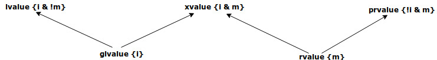

Value Categories
================

Stoustrup explains on what an *lvalue* is pages 165 of XXXX:

    *lvalue* orignally meant an expression that can be on the left-hand side of an assignment. However, this is obviously not true of a *const* object. Note also, that object in this context refers to the low-level notion of "something
    in memory" and not to the notion of class object.

On page 166 he elaborates:
 
    An *object* is a contiguous region of storage of storage; an *lvalue* is an expression that refers to an object....To complement the notion of an *lvalue*, we have the notion of an *rvalue* such as a temporary (e.g. the value returned from
    a function....

    There are two properties that for an object when it comes to addressing, copying and moving:

    * *Has Identity*: The program has the name of, address of, or reference to the object so that it is possible to determine if two objects are the same whether the value has changed, etc.
    * *Movable*: the object may be moved from (i.e. we allowed to move its value to another location and leave the object in a valid but unspecified state, rather than copying).

    It turns out that three of the four possibilities of these two properites are neede to precisely describe the C++ language rules (we have not need for object that do not have identity and cannot be moved)

   **Figure:  lvalues and rvalue and value categories** 

.. todo:: Finish above quote below.

Stoustrup further explains on 166 of XXXX the other categories of objects:

    There are two properties of an object

Links to Value Category Articles
--------------------------------

* `Quick Q: What are rvalues, lvalues, xvalues, glvalues, and prvalues? <https://isocpp.org/blog/2016/04/quick-q-what-are-rvalues-lvalues-xvalues-glvalues-and-prvalues>`_.
* `Stackoverflow: What are rvalues, lvalues, xvalues, glvalues, and prvalues? <https://stackoverflow.com/questions/3601602/what-are-rvalues-lvalues-xvalues-glvalues-and-prvalues>`_.
* `cppreference: Value categories <https://en.cppreference.com/w/cpp/language/value_category>`_.
* `CppCon 2015: John Lakos “Value Semantics: It ain't about the syntax!, Part I" <https://www.youtube.com/watch?v=W3xI1HJUy7Q>`_
* `CppCon 2015: John Lakos “Value Semantics: It ain't about the syntax!, Part II"  <https://www.youtube.com/watch?v=0EvSxHxFknM>`_.

