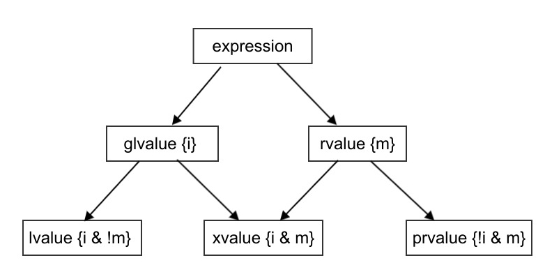

.. include:: <isopub.txt>
.. include:: <isonum.txt>

Value Categories
================

Very Helpful Articles
---------------------

* `Video: C++ lvalue rvalue xvalue glvalue prvalue <https://www.youtube.com/watch?v=yIOH95oIKbo>`_
* `Building Intuition on value categories <http://marcodiiga.github.io/building-intuition-on-value-categories>`_.
*  http://bajamircea.github.io/coding/cpp/2016/04/07/move-forward.html
* `cppreference.com Value Categories <https://en.cppreference.com/w/cpp/language/value_category>`_
* `The deal with C++14 xvalues <https://blog.jeaye.com/2017/03/19/xvalues/>`_
* `lvalues, rvalues, glvalues, prvalues, xvalues, help! <https://blog.knatten.org/2018/03/09/lvalues-rvalues-glvalues-prvalues-xvalues-help/>`_
* `Stackoverflow Explanation <https://stackoverflow.com/questions/3601602/what-are-rvalues-lvalues-xvalues-glvalues-and-prvalues>`_ 
* `Bjarne Stroustrup Article Introducing Value Categories <http://www.stroustrup.com/terminology.pdf>`_

.. * `Lvalues, rvalues and references <https://akrzemi1.wordpress.com/2011/11/09/lvalues-rvalues-and-references>`_.

Introduction
------------

Here are some examples of expressions:

.. todo:: Change the example to also include prvalues, lvalue, and xvalues. Then after the subsequent two paragraphs, re-who the expression with comments explaining their value categoris.

.. code-block:: cpp

     string c;
     string d{"some string"};

     // lvalues
     c = d; // assignment expression;
     c += d;

     double e = 1.5;
 
     ++e; // pre increment
     --e; // pre decrement

     a[n] = 10; // where: array<int, 4> a = {1, 2, 3, 4};
     *p = 15;   // where: int *p = &a[0]; 

     // prvalues
     42; // An expression as well, with no side effects
    

The `cppreference.com <https://www.cppreference.com>`_ article on `Value Categories <https://en.cppreference.com/w/cpp/language/value_category>`_ begins:

    Each C++ expression (an operator with its operands, a literal, a variable name, etc.) is characterized by two independent properties: a *type* and a *value category*.
    Each expression has some non-reference type, and each expression belongs to exactly one of the three primary value categories: *prvalue*, *xvalue*, and *lvalue*.

Here C++ means C++11. In C++03, every expression was either an lvalue or an rvalue. While this still holds true in C++11, the introduction of move construction and move assignment required new value categories. Rvalues were divided into two
subgroups, xvalues and prvalues, and we now refer to lvalues and xvalues as glvalues. Xvalues are a new kind of value category for unnamed rvalue references. Every expression is one of these three: lvalue, xvalue, prvalue. [#stackoverflow_quote]_ 

Further Elabloration
--------------------

In `The C++ Programming Language 4th Edition <https://smile.amazon.com/Programming-Language-hardcover-4th/dp/0321958322/ref=sr_1_fkmrnull_1?crid=47A4W3MV3W0Y&keywords=the+c%2B%2B+programming+language+hardcover+4th+edition&qid=1553447852&s=gateway&sprefix=the+c%2B%2B+prog%2Caps%2C206&sr=8-1-fkmrnull>`_,
(on pages 165 and 166) Bjarne Stroustrup explains in practical terms the different expression value categories of C++11:

    *lvalue* orignally meant an expression that can be on the left-hand side of an assignment. However, this is obviously not true of a *const* object. Note also, that object in this context refers to the low-level notion of "something
    in memory" and not to the notion of class object.

    An *object* is a contiguous region of storage of storage; an *lvalue* is an expression that refers to an object....To complement the notion of an *lvalue*, we have the notion of an *rvalue* such as a temporary (e.g. the value returned from
    a function).

    There are two properties that matter for an object when it comes to addressing, copying and moving:

    * *Has Identity*: The program has the name of, address of, or reference to the object so that it is possible to determine if two objects are the same, whether the value has changed, etc.
    * *Movable*: the object may be moved from (i.e. we are allowed to move its value to another location and leave the object in a valid but unspecified state, rather than copying).

    It turns out that three of the four possibilities of these two properites are needed to precisely describe the C++ language rules (we have no need for object that do not have identity and cannot be moved). Using "**m**
    for movable" and "**i** for has identity", we can represent this classification of expressions graphically:

   **Figure: value categories** 
..

    So, a classical lvalue is something that has identity and cannot be moved (because we could examine it after the move), and a classical rvalue is anything that we are allowed to move from. The other alternatives 
    are *prvalue* ("pure rvalue"), *glvalue* ("generalized lvalue"), and *xvalue* ("x" for "extraordinary"). For example:

To sum up, in C++11, expressions that:

    * have identity and cannot be moved from are called **lvalue** expressions;
    * have identity and can be moved from are called **xvalue** expressions;
    * do not have identity and can be moved from are called **prvalue** ("pure rvalue") expressions;
    * do not have identity and cannot be moved from are not used. 

If an expression *has identity*, then it is possible to determine whether the expression refers to the same entity as another expression, such as by comparing addresses of the objects or the functions they identify (obtained directly or indirectly). If an expression can be *moved from*, then the move constructor, the
move assignment operator or any function that implements move semantics can bind to the expression.

The expressions that have identity are called "glvalue expressions" (glvalue stands for "generalized lvalue"). Both lvalues and xvalues are glvalue expressions.  The expressions that can be moved from are called "rvalue expressions". Both prvalues and xvalues are rvalue expressions. 

Again, in C++11, every expression is one of these three: lvalue, xvalue, prvalue. A Venn diagram would look like this:

   **Figure: value categories as Venn Diagram** 

Examples
--------

Examples of lvalues include:

1. the name of a variable, a function or a data member. Even if the variable's type is rvlaue reference, the expression consisting of its name is an lvalue expression.
2. A function call or an overloadws operator expression whose return type is an lvalue reference.
3. ``x = y``, ``x += y``, ``x %= y``, and all other built-in assignement and compound assigment expressions.
4. A cast expression that casts to an lvalue reference: ``static_cast<int&>(x)``.
5. Built-in pre-increment and post-incremant expressions.
6. ``*x``, build-in indirection operator expression.
7. ``x[i]``, built-in subscript expressions, except when x is an array rvalue.

STOPPED VIDEO at 5:00 minutes

Significance of Value categories
--------------------------------

.. todo:: Use lvalue examples from cppreference.com

.. code-block:: cpp

    void f(vector<stinrg>& vs)
    {
         vector<string>& v2 = std::move(vs);
    }

..

    Here ``std::move(vs)`` is an xvalue: it clearly has idenity (we can refer to it as ``vs``), but we have explicitly given permission for it to be moved from by calling ``std::move()``.
    
    For praictical programming, thinking in terms of rvalue and lvalue is usually sufficient. Note that every expression is either an lvalue or an rvalue, but not both.

.. rubric:: Footnotes

.. [#cppreference_] See `Value Categories at cppreference.com <https://en.cppreference.com/w/cpp/language/value_category>`_ 
.. [#stackoverflow_quote] This paragraph is quotes from the third response to the Stackoverflow question:  `What are rvalues, lvalues, xvalues, glvalues, and prvalues? <https://stackoverflow.com/questions/3601602/what-are-rvalues-lvalues-xvalues-glvalues-and-prvalues>`_.
