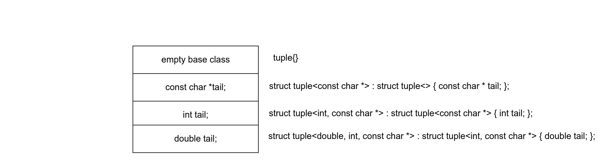

.. include <isopub.txt>

.. |nbsp| unicode:: 0xA0 
   :trim:

Variadic Templates
==================

Good articles on implementing C++ Variadic Templates
----------------------------------------------------

* `What Does Haskell Have to Do with C++? <https://bartoszmilewski.com/2009/10/21/what-does-haskell-have-to-do-with-c/>`_
* `C++11 - New features - Variadic templates <http://www.cplusplus.com/articles/EhvU7k9E/>`_
* `An introduction to C++'s variadic templates: a thread-safe multi-type map <https://jguegant.github.io/blogs/tech/thread-safe-multi-type-map.html>`_

Variadic Class Template
-----------------------

A variadic class template can be instantiated with a varying number of template arguments. One use case for a variadic class template is a recursive data structure. A tuple can be implemented as recursive data structure using a variadic class template.

.. code-block:: cpp

    template<class... Types> struct tuple; // Forward declaration 

    // Partial template specialization for the case when no template arguments are supplied 
    template<class... Types> struct tuple<> {}; 

    // public inheritance is the default for structs.
    template <class T, class... Ts> struct tuple<T, Ts...> : tuple<Ts...> { 

        // Invoke immediate base struct template with remaining arguments sans T argument,
        // and construct taiil using t, of type T.
        tuple(T t, Rest... ts) : tuple<Ts...>(ts...), tail(t) {}
        T tail;
    };

    tuple<> t0;           // Types contains no arguments. Same as: tuple t0;
    tuple<int> t1;        // Types contains one argument: int
    tuple<int, float> t2; // Types contains two arguments: int and float
    tuple<0> error;       // error: 0 is not a type

Defining Recursive Data Structures Using Variadic Class Templates
-----------------------------------------------------------------

Introduction
++++++++++++

To better motivate a sample tuple implementation, first consider this series of derived structs, where each struct in the hierarchy has a sole data member *tail*:

.. code-block:: cpp

    struct bottom {};
    
    struct A : bottom {
    
        A(const string& s) : tail{s}
        {
        }
        string tail;
    };
    
    struct B : A {

	B(double d, const string& s) : A(s), tail{d}
	{
	}
	double tail;
    };
    
    struct C : B {
	C(int i, double d, const string& s) : tail{i}, B(d, s)
        {
        }
	int tail;
    };

To access individual tail members of a ``C`` instance, like the one below, use ``static_cast<subtype_here>(tup)``: 

.. code-block:: cpp
    
    auto i = 5;
    auto d = 10.5;
    auto string s{"hello world!"}; 

    C c(i, d, s);

    auto x1 = c.tail; // tail is C::tail

    auto x2 = static_cast<B&>(c).tail; // tail is B::tail

    auto x3 = static_cast<A&>(c).tail; // tail is A::tail

A Recursive Data Structure Example Using a Variadic Class Template
++++++++++++++++++++++++++++++++++++++++++++++++++++++++++++++++++

The preceeding code is just the sort of recursive data structure where variadic templates can make life easier. We begin by defining ``struct tuple<class...Types>``:

.. note:: The complete ``tuple`` source is at `github <https://github.com/kurt-krueckeberg/tuple>`_.

.. code-block:: cpp

    template<class... Ts> struct tuple; //forward reference

    // Template specializtion for empty list of template arguments, which serves as the 
    // base struct for tuples.
    template<> struct tuple<> { 
    
        tuple() // The default constructor is only include to help exlain the code.
        {
  	    std::cout << "In template<> tuple<>::tuple() constructor, which has NO member tail." << std::endl;
        }
    }; 
    
    // Recall that public inheritance is the default for structs.
    template<class T, class... Ts> struct tuple<T, Ts...> : tuple<Ts...> { 
    
        tuple(T t, Ts... ts) : tuple<Ts...>(ts...), tail(t)
        {
            // To help explain what is going on: 
            std::cout << "  In constructor for " <<  __PRETTY_FUNCTION__ << " where tail = " << tail << std::endl;
        }
    
        T tail;
    };
    
The instantiation of, say, ``tuple<double, int, const char*>`` will generate these template instantiations

.. code-block:: cpp

    struct tuple<> { // base of inheritance hierarchy
        tuple()
        {
            std::cout << "In template<> tuple<>::tuple() constructor, which has NO member tail." << std::endl;
        }
    }

    struct tuple<const char *> : tuple<> { // next to bottom level

        tuple(const char *t) : tail(t)
        {
            std::cout << "In constructor for " <<  __PRETTY_FUNCTION__ << " where tail = " << tail << std::endl;
        }

        const char *tail; 
    };

    struct tuple<int, const char *> : struct tuple<const char *> { // next to top level of hierachy
       tuple(int t) : tail(t)
       {
          std::cout << "In constructor for " <<  __PRETTY_FUNCTION__ << " where tail = " << tail << std::endl;
       }
       int tail; 
    };    
    
    struct tuple<double> : struct tuple<int, const char *> { // top of inheritance hierarchy
       tuple(double t) : tail(t)
       {
          std::cout << "In constructor for " <<  __PRETTY_FUNCTION__ << " where tail = " << tail << std::endl;
       }

       double tail; // top level 
    };    

The instantiated class hierarchy above can also be seen from the output of the default constructors. The output of: 

.. code-block:: cpp

    tuple<double, int, const char *> t(10, 10.5, "hello world!");

shows the four levels of the struct hierarchy being instantiated: 

.. raw:: html
 
    <pre>
    In template<> tuple<>::tuple() constructor, which has NO member tail.
    In constructor for tuple<T, Ts ...>::tuple(T, Ts ...) [with T = const char*; Ts = {}] where tail = hello world!
    In constructor for tuple<T, Ts ...>::tuple(T, Ts ...) [with T = double; Ts = {const char*}] where tail = 10.5
    In constructor for tuple<T, Ts ...>::tuple(T, Ts ...) [with T = int; Ts = {double, const char*}] where tail = 5
   </pre>

Visually the layout of ``tuple<double, int, const char *>`` looks like this:

Accessing Elements of the Recursive Data Structure
++++++++++++++++++++++++++++++++++++++++++++++++++

We can now instantiate tuples of varying types, but how do we access its elements? How do we retrieve or change, say, the ``int`` value above or that ``const char *``? It boils down to determing at what subtype level the ``int tail`` member is in the inheritance hierarchy, and then casting the
tuple to this subtype and retrieving that subtype's ``tail`` member. The variadic template function ``get<size_t, tuple<Ts ...>>`` does this. ``get<size_t, tuple<Ts ...>>`` uses another recursive data structure, also defined using variadic class templates, 
``template<std::size_t Index, class _tuple> struct tuple_element``, to retrieve the appropriate subtype. 

``tuple_element``'s sole purpose is to provide type information about a specific level of the ``tuple`` hierachy, the level where the correct ``tail`` member is located. Unlike ``tuple``, which contains a sole ``tail`` data member at each level of its recursive structure, ``tuple_element`` contains no data members. Instead it only
contains the two *type definitions* below. And these two type definitions only occur in the at the bottom level of the ``tuple_element`` hierarchy, in the partial template specialization ``template<std::size_t Index, class _tuple> struct tuple_element<0, class _tuple>``:

1. ``using base_tuple_type = tuple<T, Rest...>;`` // This is the subtype where the correct tail member resides.
2. ``using value_type = T&;``                     // This is a reference to tail's type.

To better grasp how ``tuple_element<std:size_t, tuple<class T, class...Rest>>`` works we add print statements to tuple_element's default constructors. The default constructor is not actually needed, but was added to show how ``tuple_element`` works:

.. code-block:: cpp

    // tuple_element forward declaration.
    template<std::size_t Index, class _tuple> struct tuple_element;
    
    // recursive data structure tuple_element definition
    template <std::size_t Index, class T, class... Rest>  struct tuple_element<Index, tuple<T, Rest...>> : 
         public tuple_element<Index - 1, tuple<Rest...> > {
    
        tuple_element()
        {
          std::cout << "  In tuple_element<" << Index << ", tuple<T, Rest...>>::tuple(), where there are not type definitions." << std::endl;
        }
    };
    
    // partial template specialization when first parameter is zero: tuple_element<0, tuple<T, Rest...>>.
    template<class T, class... Rest>  struct tuple_element<0, tuple<T, Rest...>>  {
    
      using value_type = T&;                 // Reference to tail's type.
      using base_tuple_type = tuple<T, Rest...>;  // The type of the tuple instance
    
      tuple_element()
      {
          std::cout << "In tuple_element<0, T, Rest...>>::tuple(), where there are these two type definitions:" << std::endl;
          std::cout << "\tusing value_type = T&" << std::endl;
          std::cout << "\tusing base_tuple_type = tuple<T, Rest>" << std::endl;
      }
    };
    
    /*
     * get reference to Index element of tuple
     */
    template<size_t Index, class... Type> inline 
                           typename tuple_element<Index, tuple<Type...>>::value_type get(tuple<Type...>& _tuple)
    {
        // We will cast _tuple to the base type of the corresponding tuple_element<Index,  tuple<Type...>> recursive struct's base type.
        using base_tuple_type = typename tuple_element<Index, tuple<Type...>>::base_tuple_type;
        
        std::cout << "In get<" << Index << ">(some_tuple)" << " doing this cast: static_cast<base_tuple_type&>(_tuple).tail\n---------" << std::endl;
        
        return static_cast<base_tuple_type&>(_tuple).tail;
    }
    
If we instantiate ``tuple_element<1, tuple<double, int, const char*>> te1`` and ``tuple_element<2, tuple<double, int, const char*>> te2``

.. code-block:: cpp

    tuple_element<1, tuple<double, int, const char*>> te1;

    std::cout << "\n";

    tuple_element<2, tuple<double, int, const char*>> te2;

we will see this output: 

.. raw:: html
 
    <pre>
    In tuple_element<0, T, Rest...>>::tuple(), where there are these two type definitions:
	    using value_type = T&
	    using base_tuple_type = tuple<T, Rest>
      In tuple_element<1, tuple<T, Rest...>>::tuple(), where there are not type definitions.

    In tuple_element<0, T, Rest...>>::tuple(), where there are these two type definitions:
	    using value_type = T&
	    using base_tuple_type = tuple<T, Rest>
      In tuple_element<1, tuple<T, Rest...>>::tuple(), where there are not type definitions.
      In tuple_element<2, tuple<T, Rest...>>::tuple(), where there are not type definitions.
    </pre>
    
The actual instantiations that would occur when, say, ``element_tuple<1, tuple<int, double, const char *>>`` is declared would be: 

.. code-block:: cpp

    struct tuple_element<0, tuple<int, const char*>>  {
           using value_type = int;
           using base_tuple_type = tuple<int, const char *>;
    }; 

    struct tuple_element<1, tuple<double, int, const char*>> : struct tuple_element<0, tuple<int, const char*>> {};
 
Notice that only the base struct of the ``tuple_element`` hierarchy has the two type definitions seen in the output above. If we next look at the ouput from ``get<2>(some_instance)``

.. code-block:: cpp

    tuple<int, double, const char *> tup1(5, 10.5, "hello world!");

    get<2>(tup1);

we will see:

.. raw:: html
 
    <pre>
    In template<> tuple<>::tuple() constructor, which has NO member tail.
      In constructor for tuple<T, Ts ...>::tuple(T, Ts ...) [with T = const char*; Ts = {}] where tail = hello world!
      In constructor for tuple<T, Ts ...>::tuple(T, Ts ...) [with T = double; Ts = {const char*}] where tail = 10.5
      In constructor for tuple<T, Ts ...>::tuple(T, Ts ...) [with T = int; Ts = {double, const char*}] where tail = 5
    In get<2>(some_tuple) doing this cast: static_cast<base_tuple_type&>(_tuple).tail
    </pre>

To understand the ``static_cast`` in ``get<2>(tup1)``, we look first at the instantiation of the function ``get<2>(tup1)``

.. code-block:: cpp

    tuple_element<2, tuple<int, double, const char *>>::value_type get<2>(tuple<int, double, const char *>& _tuple)
    {
      // We will cast _tuple to the base type of the corresponding tuple_element<Index,  tuple<Type...>> recursive struct's base type.
      using base_tuple_type = tuple_element<2, tuple<int, double, const char *>>::base_tuple_type;
    
      std::cout << "In get<" << Index << ">(some_tuple)" << " doing this cast: static_cast<base_tuple_type&>(_tuple).tail\n---------" << std::endl;
    
      return static_cast<base_tuple_type&>(_tuple).tail;
    }

``_tuple`` will be cast to the ``tuple_element<2, tuple<int, double, const char *>>::base_tuple_type``, where ``base_tuple_type`` is defined in the base struct of ``tuple_element<2, tuple<int, double, const char *>>::base_tuple_type``,
which is ``tuple_element<0, tuple<const char *>>``, and is:

``using base_tuple_type = tuple<const char *>;``

Likewise ``tuple_element<2, tuple<int, double, const char *>>::value_type`` is also defined in ``tuple_element<0, tuple<const char *>>`` as:

 ``using value_type=const char *;``

Substituting these values into the instantiation of ``get<2>(tup1)`` gives us

.. code-block:: cpp

    const char *get<2>(tuple<int, double, const char *>& _tuple)
    {
      return static_cast< tuple<const char *>& >(_tuple).tail; // This returns 'const char * tail;' member of the base struct.
    }

Similarly the instantiation of ``get<1`>(tup1)`` 

.. code-block:: cpp

    tuple_element<1, tuple<double, int, const char *>>::value_type get<1>(tuple<int, double, const char *>& _tuple)
    {
      // We will cast _tuple to the base type of the corresponding tuple_element<Index,  tuple<Type...>> recursive struct's base type.
      using base_tuple_type = tuple_element<1, tuple<int, double, const char *>::base_tuple_type;
    
      return static_cast<base_tuple_type&>(_tuple).tail; // This returns 'const char * tail;' member of the base struct.
    }

simplifies to

.. code-block:: cpp

    double get<1>(tuple<int, double, const char *>& _tuple)
    {
      // This returns the 'double tail' member of the base struct
      return static_cast< tuple<double, const char *>& >(_tuple).tail; 
    }

And finally, the instantiation of ``get<0>(tup1)`` 

.. code-block:: cpp

    tuple_element<0, tuple<int, double, const char *>>::value_type get<2>(tuple<int, double, const char *>& _tuple)
    {
      // We will cast _tuple to the base type of the corresponding tuple_element<Index,  tuple<Type...>> recursive struct's base type.
      using base_tuple_type = tuple_element<0, tuple<int, double, const char *>>::base_tuple_type;
    
      std::cout << "In get<" << Index << ">(some_tuple)" << " doing this cast: static_cast<base_tuple_type&>(_tuple).tail\n---------" << std::endl;
    
      return static_cast<base_tuple_type&>(_tuple).tail;
    }

simplifies to

.. code-block:: cpp

    int get<0>(tuple<int, double, const char *>& _tuple)
    {
      // This returns the 'int tail' member of the "base" struct, which is the same as the the top-level struct.
      return static_cast< tuple<int, double, const char *>& >(_tuple).tail;
    }

Avoiding Needless Copy Construction
+++++++++++++++++++++++++++++++++++

Each tail element in the recursive tuple data structure is copy constructed. We really want a tuple constructor that takes forwarding references so that both lvalue and rvalue parameters can be forwarded to each element's constructor. This template member function constructor does that:

.. code-block:: cpp

    template<class... Ts> struct tuple; //forward reference
    
    // Template specializtion for empty list of template arguments, the base struct of the recursively implemented tuple 
    // data structure.
    template<> struct tuple<> { 
    
        tuple()
        {
  	    std::cout << "In template<> tuple<>::tuple() constructor, which has NO member tail." << std::endl;
        }
    }; 
    
    // Recall that public inheritance is the default for structs.
    template<class T, class... Ts> struct tuple<T, Ts...> : tuple<Ts...> { 

        //  std::forward<Args>(args) below forwards the constructor arguments to each element's, preserving lvalue and rvalue parameters.

        template<class Arg1, class... Args> tuple(Arg1&& arg1, Args&&...args) : tuple<Ts...>(std::forward<Args>(args)...), tail(std::forward<Arg1>(arg1))
        {
            std::cout << "  In constructor for " <<  __PRETTY_FUNCTION__ << std::endl;
        }
    
        T tail;
    };
 
Template Deduction Guides for Variadic Class Templates
------------------------------------------------------

See:

* The article `Modern C++ Features – Class Template Argument Deduction <https://arne-mertz.de/2017/06/class-template-argument-deduction/>`_ describes Template Deduction Guides. 

* `Class template argument deduction(since C++17) <https://en.cppreference.com/w/cpp/language/class_template_argument_deduction>`_.

.. todo:: Show how the deduction guide for tuple works and how to implement one for our tuple class.

.. todo:: Mention an alternate implmentation for `tuple using C++17 <https://medium.com/@mortificador/implementing-std-tuple-in-c-17-3cc5c6da7277>`_.

* `Variadic Templates in C++ <https://eli.thegreenplace.net/2014/variadic-templates-in-c/>`_.

Variadic Template Function
--------------------------
 
As `Parameter pack(since C++11) <https://en.cppreference.com/w/cpp/language/parameter_pack>`_ explainst: "A variadic function template can be called with any number of function arguments (the template arguments are deduced through template argument deduction)".

Recursive calls are often used in the implementation of variadic template funtions like the one below, which converts its input into a vector of strings. But there are `Pack expansion tricks <https://arne-mertz.de/2016/11/more-variadic-templates/>`_ to simplify convoluted recursive code
like that below. 

.. code-block:: cpp 

    #include <vector>
    #include <string>
    #include <sstream>
    #include <iostream>
    #include <algorithm>
    #include <iterator>
    
    template<class T> std::string stringify_impl(const T& t); // Fwd declaration
    
    // Forward declarations
    template<class T, class... Rest> std::vector<std::string> stringify(const T& t1, const Rest& ... params);
    
    std::vector<std::string> stringify(); 
    
    template<class T, class... Rest> std::vector<std::string> stringify(const T& t, const Rest& ... params)
    {
      std::cout << "In stringify(" << t << ", const Rest& ... params) " << std::endl;
              
      std::vector<std::string> s;
    
      s.push_back(stringify_impl(t));
      
      auto remainder = stringify(params...);
      
      s.insert(s.end(), remainder.begin(), remainder.end());
      
      //print(s, "After call to s.insert(s.end(), remainder.begin(), remainder.end()), s = " );
      return s;
    }
    
    // Convert input to a std::string
    template<class T> std::string stringify_impl(const T& t)
    {
        std::stringstream ss;
        ss << t;
        return ss.str();
    }
    
    // Overload that takes no arguments and returns empty std::vector<std::string>.
    std::vector<std::string> stringify()
    {
        std::cout << "In non-template version stringify() that returns an empty std::vector<std::string>." << std::endl;
            
        return {};
    }

By using  a `return braced-init-list <https://en.cppreference.com/w/cpp/language/return>`_, in which the parameter pack expansion is a call to the method doing the real work like this example:

.. code-block:: cpp

    #include <vector>
    #include <string>
    #include <sstream>
    
    template<class ... Param> std::vector<std::string> stringify(const Param& ... param)
    {
       auto stringify_impl = [] (const auto& t) {
           
           std::stringstream ss;
           ss << t;
           return ss.str();
       };
       
       return { stringify_impl(param)... };
   }

The compilers the RVO/NRVO elides copy or move construction. 

Further Explanation
-------------------

"In a primary class template, the template parameter pack must be the final parameter in the template parameter list. In a function template, the template parameter pack may appear earlier in the list provided that all following parameters can
be deduced from the function arguments, or have default arguments:"

.. code-block:: cpp

    template<typename... Ts, typename U> struct Invalid; // Error: Ts.. not at the end
     
    template<typename ...Ts, typename U, typename=void>
    void valid(U, Ts...);     // OK: can deduce U
    // void valid(Ts..., U);  // Can't be used: Ts... is a non-deduced context in this position
     
    valid(1.0, 1, 2, 3);      // OK: deduces U as double, Ts as {int,int,int} 

C++17 Does Offer Limited Iteration Over a Parameter Pack
--------------------------------------------------------

In C++ a variadic template function like ``sum`` below required two versions of ``sum`` to be implemented, one taking just one parameter type and the other taking at least two or more parameters types:

.. code-block:: cpp

    template<typename T>
    T sum(T v) 
    {
      return v;
    }
    
    template<typename T, typename... Args>
    T sum(T first, Args... args) 
    {
      return first + adder(args...);
    }
    
    long sum = adder(1, 2, 3, 8, 7);
    
    std::string s1 = "x", s2 = "aa", s3 = "bb", s4 = "yy";
    std::string ssum = adder(s1, s2, s3, s4);

C++17 offers a limited form of iteration over elements of a parameter pack, which allows us to implement ``adder()`` with only one template:        

.. code-block:: cpp

    template<Number... T>int sum(T... v)
    {  
        return (v + ... + 0);     // add all elements of v starting with 0
    }
