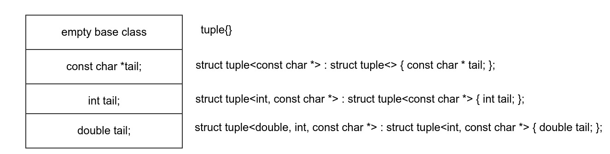

Variadic Templates
==================

Good articles on implementing C++ Variadic Templates
----------------------------------------------------

* `C++11 - New features - Variadic templates <http://www.cplusplus.com/articles/EhvU7k9E/>`_
* `Wkipedia Article on Variadic Template <https://en.wikipedia.org/wiki/Variadic_template>`_
* `An introduction to C++'s variadic templates: a thread-safe multi-type map <https://jguegant.github.io/blogs/tech/thread-safe-multi-type-map.html>`_

Variadic Class Template
-----------------------

`Parameter pack(since C++11) <https://en.cppreference.com/w/cpp/language/parameter_pack>`_ explains that: A variadic class template can be instantiated with a varying number of template arguments.

.. code-block:: cpp

    template<class ... Types> struct Tuple; // fwd ref.

    template<class ... Types> struct Tuple<> {}; // No arguments partial template specialization

    template <class T, class... Ts> struct Tuple<T, Ts...> : Tuple<Ts...> { // public inheritance is the default for structs.
        Tuple(T t, Ts... ts) : Tuple<Ts...>(ts...), tail(t) {}
        T tail;
    };
    Tuple<> t0;           // Types contains no arguments
    Tuple<int> t1;        // Types contains one argument: int
    Tuple<int, float> t2; // Types contains two arguments: int and float
    Tuple<0> error;       // error: 0 is not a type

Defining Recursive Data Structures Using Variadic Class Templates
-----------------------------------------------------------------

Consider this series of derived structs, where each struct in the hierarchy has the member variable tail:

.. code-block:: cpp

    struct bottom {};
    
    struct A : bottom {
    
        A(const string& s) : tail{s}
        {
        }
        string tail;
    };
    
    struct B : A {

	B(double d, const string& s) : A(s), tail{d}
	{
	}
	double tail;
    };
    
    struct C : B {
	C(int i, double d, const string& s) : tail{i}, B(d, s)
        {
        }
	int tail;
    };

Now given an instance of C, like that below, how do we access each tail member at each level of the hierarchy?

.. code-block:: cpp
    
    auto i = 5;
    auto d = 10.5;
    auto string s{"hello world!"}; 

    C c(i, d, s);

    auto x1 = c.tail; // tail is C::tail

    auto x2 = static_cast<B&>(c).tail; // tail is B::tail

    auto x3 = static_cast<A&>(c).tail; // tail is A::tail

Likewise, using variadic templates we can easily recursively define such a hierarchy:

.. code-block:: cpp

    template <class... Ts> struct Tuple { // This will be the final base Tuple of the hierarchy all all Tuple<Ts...> instances.
    
        Tuple()
        {
  	    std::cout << "In base Tuple constructor, which has NO member tail." << std::endl;
        }
    }; 
    
    template <class T, class... Ts> struct Tuple<T, Ts...> : Tuple<Ts...> { // public inheritance is the default for structs.
    
        Tuple(T t, Ts... ts) : Tuple<Ts...>(ts...), tail(t)
        {
            std::cout << "In constructor of " <<  __PRETTY_FUNCTION__ << " where tail = " << tail << std::endl;
        }
    
        T tail;
    };
    
The instantiation of ``tuple<double, int, const char*>`` will recursively generate these template instiations

.. code-block:: cpp

    struct Tuple<> { // base of inheritance hierarchy
        Tuple() {
  	    std::cout << "In base Tuple constructor, which has NO member tail." << std::endl;
        }
    }

    struct Tuple<const char *> : Tuple<> { // next to bottom level

        Tuple(const char *t) : tail(t)
        {
            std::cout << "In constructor of " <<  __PRETTY_FUNCTION__ << " where tail = " << tail << std::endl;
        }

        const char *tail; 
    };

    struct Tuple<int, const char *> : struct Tuple<const char *> { // next to top level of hierachy
       Tuple(int t) : tail(t)
       {
          std::cout << "In constructor of " <<  __PRETTY_FUNCTION__ << " where tail = " << tail << std::endl;
       }
       int tail; 
    };    
    
    struct Tuple<double> : struct Tuple<int, const char *> {
       Tuple(double t) : tail(t)
       {
          std::cout << "In constructor of " <<  __PRETTY_FUNCTION__ << " where tail = " << tail << std::endl;
       }

       double tail; // top level 
    };    

If we now instantiate ``tuple<double, int, const char *>`` 

.. code-block:: cpp

    auto i = 10;
    auto d = 10.5;
    const char *p = "hellow orld!";

    Tuple<double, int, const char *> t(i, d, p);

the constructors of ``tuple<double, int, const char*> tuple(12.2, 43, "big")`` will enerate this output showing these four levels being instantiated 

.. raw:: html
 
    <pre>
    In base Tuple constructor, which has NO member tail.
    In constructor of Tuple<T, Ts ...>::Tuple(T, Ts ...) [with T = const char*; Ts = {}] where tail = big
    In constructor of Tuple<T, Ts ...>::Tuple(T, Ts ...) [with T = int; Ts = {const char*}] where tail = 42
    In constructor of Tuple<T, Ts ...>::Tuple(T, Ts ...) [with T = double; Ts = {int, const char*}] where tail = 12.2
   </pre>

Thus the layout of ``tuple<double, int, const char *>`` looks like this

   **Figure: layout of tuple inheritance hierarchy** 

.. code-block:: cpp

    template <class... Ts> struct Tuple { // <-- This Tuple definition is needed. It will be the final base Tuple of all Tuple<Ts...>'s.
    
        Tuple()
        {
  	    std::cout << "In base Tuple constructor, which has NO member tail." << std::endl;
        }
    }; 
    
    template <class T, class... Ts> struct Tuple<T, Ts...> : Tuple<Ts...> { // public inheritance is the default for structs.
    
    
        Tuple(T t, Ts... ts) : Tuple<Ts...>(ts...), tail(t)
        {
            std::cout << "In constructor of " <<  __PRETTY_FUNCTION__ << " where tail = " << tail << std::endl;
        }
    
        T tail;
    };
    
the definition of ``Tuple<double, int, const char*>`` generated these template instations

.. code-block:: cpp

    struct Tuple<double, int, const char *> : struct Tuple<int, const char *> : struct Tuple<const char *> : Tuple<> {

       double tail; // top level of hierachy
    };    
    
    // The struct above will in turn cause this struct to be instantiated... 
    struct Tuple<int, const char *> : struct Tuple<const char *> : Tuple<> {

       int tail; // next to top level
    };    

    // which in turn will cause this template to be instantiated
    struct Tuple<const char *> : struct Tuple {

       const char *int tail; // next to bottom level 
    };    

    // which in turn will cause this last base template to be instantiated
    struct Tuple {

        // bottom of hierachy
    };    

An the constructors of ``tuple<double, int, const char*> tuple(12.2, 43, "big")`` will enerate this output showing these four levels being instantiated 

.. raw:: html
 
    <pre>
    In base Tuple constructor, which has NO member tail.
    In constructor of Tuple<T, Ts ...>::Tuple(T, Ts ...) [with T = const char*; Ts = {}] where tail = big
    In constructor of Tuple<T, Ts ...>::Tuple(T, Ts ...) [with T = int; Ts = {const char*}] where tail = 42
    In constructor of Tuple<T, Ts ...>::Tuple(T, Ts ...) [with T = double; Ts = {int, const char*}] where tail = 12.2
   </pre>

Thus the layout of ``tuple<double, int, const char *>`` looks like this

   **Figure: layout of tuple inheritance hierarchy** 

.. todo:: `Variadic templates in C++ <https://eli.thegreenplace.net/2014/variadic-templates-in-c/>`_

.. todo:: Switch the implementation of ``get<int, tuple<class T, class...Rest>>()`` to that in the Netbeans version. Explain how the recursive struct ``tuple_elem`` expands and how the
    typedef/using statements appear only at the base of the hierarchy, so get<int>() is not recursive. Instead it immediately casts to the base of the hierarchy.

We can now instantiate Tuples of varying types, but how do we access its elements? How do we retrieve or change, say, ``int`` value above or that ``const char *``? This boils down to determing where the ``int tail;`` member is in the layout hierarchy. We know it is third level from the
bottom. To retrieve the corresponding ``int tail`` member, we use a variadic template function called ``Get<int, tuple<Ts ...>``, and ``Get()`` in turn uses another recursive data structure ``elem_type_holder`` that paralells ``Tuple``. But unlike ``Tuple`` that contains the sole
``tail`` data member at all level of its recursive structure, ``elem_type_holder`` contains no data members. Instead it contains a *type definition* at each level (defined by means of a using statement).

Here is the definition of ``elem_type_holder`` and ``Get()``:

.. code-block:: cpp
 
    template <std::size_t, class> struct elem_type_holder;
    
    // partial template specializtion of elem_type_holder when size_t==0.
    template <class T, class... Ts> struct elem_type_holder<0, Tuple<T, Ts...>> {
    
       using type = T;
    };
    
    template <std::size_t k, class T, class... Ts> struct elem_type_holder<k, Tuple<T, Ts...>> {
    
        // Define 'type' of, say, elemen_type_holder<4, T1, T2, T3, T4> to be elemen_type_holder<3, T2, T3, T4>::type.
        // Does this have to do with zero-base indexing?
        using type = typename elem_type_holder<k - 1, Tuple<Ts...>>::type;
    };
   
    template <std::size_t k, class... Ts>  typename std::enable_if<  k == 0, typename elem_type_holder<0, Tuple<Ts...>>::type&  >::type  Get(Tuple<Ts...>& t)
    {
      std::cout << "In Get<0>(t) returning t.tail = " << t.tail << "\n-----------" << std::endl;
      return t.tail;
    }
    
    template <std::size_t k, class T, class... Ts>  typename std::enable_if<  k != 0, typename elem_type_holder<k, Tuple<T, Ts...>>::type&  >::type  Get(Tuple<T, Ts...>& t)
    {
       std::cout << "In Get<" << k << ">(Tuple<T, Ts...>& t)" << " calling Get<" << k - 1 << ">(static_cast<Tuple<Ts...>&>(t))" << std::endl;
       
       // Invoke Get<k - l>(on immediate base class of t)
 
       return Get<k - 1>(static_cast<Tuple<Ts...>&>(t));
    } 
    
We now instantiate ``Tuple<double, int, const char*>`` and examine the ouput from ``Get<int>(some_instance)``:

.. raw:: html
 
    <pre>
    In base Tuple constructor, which has NO member tail.
    In constructor of Tuple<T, Ts ...>::Tuple(T, Ts ...) [with T = const char*; Ts = {}] where tail = big
    In constructor of Tuple<T, Ts ...>::Tuple(T, Ts ...) [with T = int; Ts = {const char*}] where tail = 42
    In constructor of Tuple<T, Ts ...>::Tuple(T, Ts ...) [with T = double; Ts = {int, const char*}] where tail = 12.2
    In Get<0>(t) returning t.tail = 12.2
    -----------
    In Get<1>(Tuple<T, Ts...>& t) calling Get<0>(static_cast<Tuple<Ts...>&>(t))
    In Get<0>(t) returning t.tail = 42
    -----------
    In Get<2>(Tuple<T, Ts...>& t) calling Get<1>(static_cast<Tuple<Ts...>&>(t))
    In Get<1>(Tuple<T, Ts...>& t) calling Get<0>(static_cast<Tuple<Ts...>&>(t))
    In Get<0>(t) returning t.tail = big
    -----------
   </pre>

Get<...>() is a recursive template function.  It terminates when k is zero, and the partial template specialization ``template<std::size_t, class... Ts> Get<0, Tuple<Ts...>& t)`` is then invoked that returns ``t.tail``.

.. todo:: Explain how Get() returns the correct tail member of the hierarchy. Lastly explain how elem_type_holder deteremines the return type. Finally, add a template member ctor
    that takes forwarding arguments modeled after std::tuple.

.. todo:: Show a better way to inmplement `tupple using C++17 <https://medium.com/@mortificador/implementing-std-tuple-in-c-17-3cc5c6da7277>`_.

* `Variadic Templates in C++ <https://eli.thegreenplace.net/2014/variadic-templates-in-c/>`_.
* `Variadic template data structures <https://riptutorial.com/cplusplus/example/19276/variadic-template-data-structures>`_
* `Tuple implementation via variadic templates <https://voidnish.wordpress.com/2013/07/13/tuple-implementation-via-variadic-templates/>`_ also discusses how to implement tuple using variadic templates.

Variadic Function Template
--------------------------
 
`Parameter pack(since C++11) <https://en.cppreference.com/w/cpp/language/parameter_pack>`_ explains that "A variadic function template can be called with any number of function arguments (the template arguments are deduced through template argument deduction)":

.. code-block:: cpp

    template<class ... Types> void f(Types ... args);
    f();       // OK: args contains no arguments
    f(1);      // OK: args contains one argument: int
    f(2, 1.0); // OK: args contains two arguments: int and double

Further Explanation
-------------------

"In a primary class template, the template parameter pack must be the final parameter in the template parameter list. In a function template, the template parameter pack may appear earlier in the list provided that all following parameters can
be deduced from the function arguments, or have default arguments:"

.. code-block:: cpp

    template<typename... Ts, typename U> struct Invalid; // Error: Ts.. not at the end
     
    template<typename ...Ts, typename U, typename=void>
    void valid(U, Ts...);     // OK: can deduce U
    // void valid(Ts..., U);  // Can't be used: Ts... is a non-deduced context in this position
     
    valid(1.0, 1, 2, 3);      // OK: deduces U as double, Ts as {int,int,int} 

C++17 Offers Limited Iteration Over a Parameter Pack
----------------------------------------------------

In C++ a variadic template function like ``sum`` below required two versions of ``sum`` to be implemented, one taking just one parameter type and the other taking at least two or more parameters types:

.. code-block:: cpp

    template<typename T>
    T sum(T v) 
    {
      return v;
    }
    
    template<typename T, typename... Args>
    T sum(T first, Args... args) 
    {
      return first + adder(args...);
    }
    
    long sum = adder(1, 2, 3, 8, 7);
    
    std::string s1 = "x", s2 = "aa", s3 = "bb", s4 = "yy";
    std::string ssum = adder(s1, s2, s3, s4);

C++17 offers a limited form of iteration over elements of a parameter pack, which allows us to implement ``adder()`` with only one template:        

.. code-block:: cpp

    template<Number... T>int sum(T... v)
    {  
        return (v + ... + 0);     // add all elements of v starting with 0
    }
